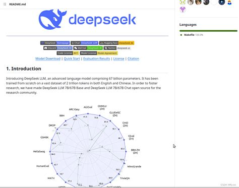

# دليلك النهائي لبناء وكلاء ذكاء اصطناعي باستخدام DeepSeek: رحلة نحو المستقبل الذكي


---

## مقدمة: لماذا يتحدث الجميع عن DeepSeek؟

تخيل أن لديك مساعدًا ذكيًا لا يفهم فقط ما تقوله، بل يتوقع احتياجاتك قبل أن تنطق بها. هل يبدو ذلك كخيال علمي؟ حسنًا، مع **DeepSeek**، هذا ليس مجرد حلم، بل واقع نعيشه اليوم. منذ تأسيسها في عام 2023، أصبحت **DeepSeek** واحدة من أبرز الأسماء في عالم الذكاء الاصطناعي. وعلى عكس العمالقة التقليديين مثل **OpenAI** و**Google**، اختارت هذه الشركة أن تكون مختلفة تمامًا.

**كيف؟**  
ببساطة، قررت **DeepSeek** فتح أبواب التكنولوجيا للجميع من خلال سياسة "المصدر المفتوح". النتيجة؟ مجتمع عالمي من المطورين والشركات الصغيرة أصبح بإمكانهم الآن بناء حلول ذكية دون الحاجة إلى ميزانيات ضخمة أو بنى تحتية معقدة. إذا كنت تبحث عن تقنية تجمع بين الكفاءة، المرونة، والأداء العالي، فإن **DeepSeek** هي بوابتك نحو المستقبل.

---

## الفصل الأول: ما هو وكيل الذكاء الاصطناعي؟

تخيل مساعدًا يعمل من تلقاء نفسه، يحلل المعلومات، يتخذ القرارات، وينفذ المهام دون الحاجة إلى أوامر مباشرة منك. هذا هو **وكيل الذكاء الاصطناعي (AI Agent)** ببساطة شديدة.

- **كيف يعمل؟**
  1. **يدرس الموقف:** يستقبل المعلومات من العالم الخارجي (مثل النصوص، الصوت، أو الصور).  
  2. **يفكر ويتخذ قرارًا:** يحلل البيانات ويقرر أفضل طريقة للرد أو التصرف.  
  3. **يتصرف:** يقوم بالمهام المطلوبة بناءً على قراراته.

- **أهم خصائصه:**
  - **يعمل لوحده:** لا يحتاج إلى تدخل بشري دائم.  
  - **يتعلم ويتقدم:** كلما زاد استخدامه، أصبح أكثر ذكاءً وكفاءة.  
  - **يتفاعل بذكاء:** يستطيع فهم الكلام البشري، الرد بشكل طبيعي، وحتى التنبؤ بما قد تحتاجه مستقبلاً.

---

## الفصل الثاني: لماذا تختار DeepSeek لبناء وكلاء الذكاء الاصطناعي؟


إذا كنت تتساءل لماذا يجب أن تختار **DeepSeek** بدلاً من الخيارات الأخرى، فإليك الإجابة:

1. **فعالية التكلفة:**  
   - تقدم **DeepSeek** كفاءة عالية في الاستدلال، مما يعني تقليل التكاليف التشغيلية بشكل كبير.  
   - تكلفة التدريب والضبط الدقيق أقل بكثير مقارنة بالمنافسين مثل **OpenAI’s GPT**.

2. **الدعم متعدد اللغات:**  
   - يمكن لوكلاء الذكاء الاصطناعي المدعومين من **DeepSeek** فهم وإنشاء ردود بلغات متعددة بدقة تشبه اللغة الأم.  
   - مثالي لتوطين الحلول الذكية في أسواق مختلفة.

3. **مرونة واجهات برمجة التطبيقات (API):**  
   - توفر واجهات برمجة تطبيقات سهلة الاستخدام تسمح بدمج الوكلاء في:
     - روبوتات الدردشة وأنظمة الأتمتة.  
     - تطبيقات مخصصة ومواقع إلكترونية.  
     - أنظمة مؤسسية متكاملة مع تقنيات أخرى مثل **LangChain** و**Hugging Face**.

4. **سهولة التكامل:**  
   - تصميم واجهات برمجة التطبيقات يضمن سرعة النشر والتعديل دون الحاجة إلى بنى تحتية معقدة.

---
### نتائج DeepSeek 📊


---


---


## الفصل الثالث: كيف تبدأ؟ خطوات عملية لبناء وكيل ذكاء اصطناعي باستخدام DeepSeek

### 1. المتطلبات الأساسية والأدوات اللازمة

#### المتطلبات المادية (Hardware):
- **للتطوير الأساسي:**
  - المعالج: Intel i5 أو ما يعادله (4 أنوية على الأقل).  
  - الذاكرة العشوائية (RAM): 8 جيجابايت كحد أدنى، ويوصى بـ 16 جيجابايت.  
  - التخزين: 50 جيجابايت على الأقل.  
  - البطاقة الرسومية (GPU): ليست ضرورية لكنها مفيدة لتحسين الأداء.

- **للاستخدام المتقدم:**
  - المعالج: Intel i7/i9 أو AMD Ryzen 9.  
  - الذاكرة العشوائية (RAM): 32 جيجابايت أو أكثر.  
  - البطاقة الرسومية (GPU): NVIDIA RTX 3090 أو A100.

#### المتطلبات البرمجية (Software):
- نظام التشغيل: Windows 10/11، macOS، أو Linux (Ubuntu موصى به).  
- لغة البرمجة: Python 3.8 أو أحدث.  
- بيئات التطوير: Jupyter Notebook، VS Code، أو PyCharm.

---

### 2. إعداد بيئة التطوير

#### الخطوة الأولى: تثبيت Python وإعداد البيئة الافتراضية
```bash
  sudo apt install python3 python3-pip
  pip install virtualenv
  virtualenv deepseek_env
  source deepseek_env/bin/activate
```
#### الخطوة الثانية: تثبيت واجهة برمجة تطبيقات DeepSeek والمكتبات المرتبطة
```bash
  pip install deepseek-ai langchain transformers
```
#### الخطوة الثالثة: اختبار الاتصال مع API
```bash
  import deepseek
  api_key = "your_deepseek_api_key"
  response = deepseek.generate_text(api_key, "مرحبًا، كيف يمكن للذكاء الاصطناعي مساعدتي اليوم؟")
  print(response)
```
### 3. أدوات أساسية لتطوير الوكلاء

- **LangChain**: لإدارة سير العمل الذكي ودعم أنظمة متعددة الوكلاء.  
- **OpenAI Gym**: لتدريب الوكلاء على التعلم المعزز.  
- **Hugging Face Transformers**: لتحسين النماذج الخاصة بمجالات معينة مثل الصحة والمالية.  
- **قواعد بيانات المتجهات (Vector Databases)**: مثل **Pinecone** و**FAISS** لتخزين الذكريات طويلة الأمد.  

## الفصل الرابع: خطوات بناء وكيل ذكاء اصطناعي باستخدام DeepSeek


### الخطوة الأولى: تحديد هدف الوكيل  
- **روبوتات الدردشة**: تقديم دعم العملاء والإجابة على الأسئلة الشائعة.  
- **وكلاء الأتمتة**: تنفيذ المهام المتكررة مثل ترتيب البريد الإلكتروني.  
- **أنظمة التوصية**: تحليل سلوك المستخدمين وتقديم توصيات مخصصة.  
- **أنظمة دعم القرار**: تحليل البيانات الضخمة لمساعدة في التنبؤات المالية أو التشخيص الطبي.  

### الخطوة الثانية: إعداد واجهة برمجة تطبيقات DeepSeek  
- الحصول على مفتاح **API**.  
- تكوين طلبات **API** بشكل صحيح.  
- إدارة حدود الاستخدام لتجنب التكاليف الزائدة.  

### الخطوة الثالثة: تنفيذ معالجة اللغة الطبيعية (NLP)  
- **معالجة المدخلات**: تنظيف وترتيب البيانات.  
- **فهم السياق**: التعرف على النية والعاطفة.  
- **هندسة التعليمات (Prompt Engineering)**: صياغة الأوامر بدقة لتحسين الاستجابات.  


---

## الفصل الخامس: أمثلة على تطبيقات العالم الحقيقي


### **روبوتات الدردشة لدعم العملاء**  
- توفير دعم **24/7** وتقليل التكاليف التشغيلية.  
- التعامل مع استعلامات متعددة اللغات.  

### **اتخاذ القرارات في القطاع المالي والصحي**  
- تحليل البيانات الضخمة لاكتشاف الاحتيال أو تقديم تشخيصات طبية دقيقة.  

### **أتمتة العمليات التجارية**  
- تصنيف البريد الإلكتروني، معالجة المستندات، وجدولة الاجتماعات.  

### **مساعدات افتراضية ذكية**  
- تحسين إدارة المهام وتقديم توصيات قائمة على البيانات.  

---

## **الخلاصة: لماذا DeepSeek هي المستقبل؟**  
مع **DeepSeek**، لديك الفرصة لبناء وكلاء ذكاء اصطناعي قادرين على تقديم تجارب مخصصة وسريعة دون الحاجة إلى موارد ضخمة أو بنى تحتية معقدة.  
سواء كنت مطورًا مستقلًا، صاحب شركة صغيرة، أو حتى باحثًا في مجال الذكاء الاصطناعي، فإن **DeepSeek** يمكن أن تكون بوابتك نحو المستقبل.  

### **باختصار... إذا كنت تريد أداءً عاليًا بتكلفة أقل، فإن DeepSeek هو الحل المثالي! **  

---


## **المراجع**  
- [أفضل أفكار تطبيقات الذكاء الاصطناعي باستخدام OpenAI](https://www.topdevelopers.co/blog/ai-app-ideas-using-openai/#types-of-openai-api-models-to-try)  
- [ما هي وكلاء الذكاء الاصطناعي؟](https://www.topdevelopers.co/blog/what-are-ai-agents/)  
- [دراسة الذكاء الاصطناعي من PwC](https://www.pwc.com/gx/en/issues/artificial-intelligence/publications/artificial-intelligence-study.html)  
- [DeepSeek مقابل ChatGPT: ما هو DeepSeek؟](https://www.topdevelopers.co/blog/deepseek-vs-chatgpt/#what-is-deepseek)  
- [تقرير سوق وكلاء الذكاء الاصطناعي - Grand View Research](https://www.grandviewresearch.com/industry-analysis/ai-agents-market-report)  
- [دليل استخدام DeepSeek خطوة بخطوة - MundoBytes](https://mundobytes.com/ar/%D9%83%D9%8A%D9%81%D9%8A%D8%A9-%D8%A7%D8%B3%D8%AA%D8%AE%D8%AF%D8%A7%D9%85-Deepseek-%D8%AE%D8%B7%D9%88%D8%A9-%D8%A8%D8%AE%D8%B7%D9%88%D8%A9/)  
- [أشهر نماذج الذكاء الاصطناعي](https://www.topdevelopers.co/blog/popular-ai-models/)  
- [أفضل تطبيقات الذكاء الاصطناعي](https://www.topdevelopers.co/blog/best-ai-apps/)  
- [استطلاع Gartner حول الذكاء الاصطناعي في خدمة العملاء](https://www.gartner.com/en/newsroom/press-releases/2024-12-09-gartner-survey-reveals-85-percent-of-customer-service-leaders-will-explore-or-pilot-customer-facing-conversational-genai-in-2025)  
- [McKinsey - بناء بنك الذكاء الاصطناعي للمستقبل](https://www.mckinsey.com/~/media/mckinsey/industries/financial%20services/our%20insights/building%20the%20ai%20bank%20of%20the%20future/building-the-ai-bank-of-the-future.pdf)  
- [توقعات الذكاء الاصطناعي من PwC](https://www.pwc.com/us/en/tech-effect/ai-analytics/ai-predictions.html)  
- [دليل أفضل شركات الذكاء الاصطناعي](https://www.topdevelopers.co/directory/ai-companies)  



